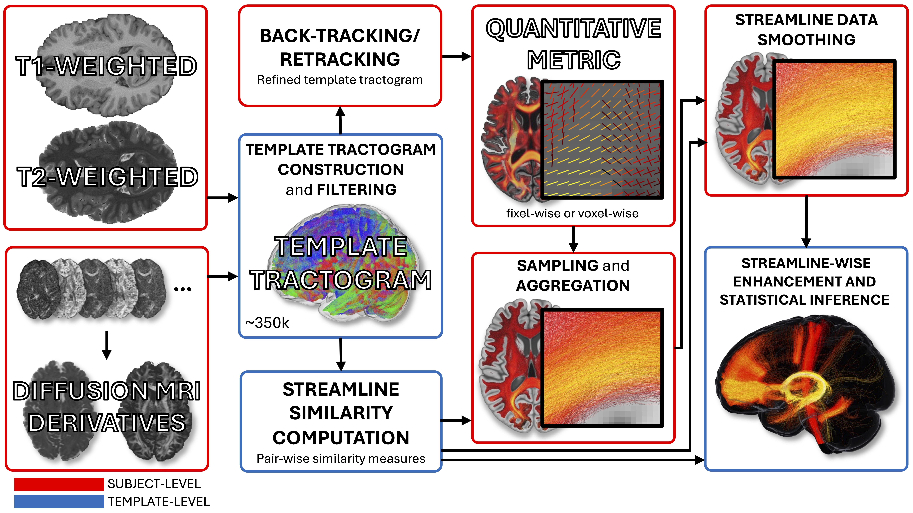

# Streamline-Based Analysis User Guide

Please, use the relevant [code](https://github.com/simzanoni/mrtrix3.git) when running this pipeline.

This document provides a user guide to conduct Streamline-Based Analysis (SBA) as presented in our [Preprint](https://doi.org/10.21203/rs.3.rs-10123464/v1).

<p align="center">
  
</p>

<p align="center">
  <em>
    Overview of the SBA pipeline. Multimodal MRI data are used to construct a study-specific tissue-unbiased template tractogram (which is first filtered and subsequently refined for each subject, while retaining streamline-to-streamline correspondence); this defines a tractogram-based coordinate system for streamline-wise analysis. Imaging measures are sampled and aggregated into streamline-wise metrics. Streamline similarity is used to enable both streamline-wise data smoothing and statistical enhancement within a permutation-based inference framework.
  </em>
</p>

## 1. Pre-processing
The desirable pre-processing steps will vary depending on the specific dataset. Please, refer to external resources, such as this [tutorial](https://andysbrainbook.readthedocs.io/en/latest/MRtrix/MRtrix_Course/MRtrix_04_Preprocessing.html) or this [tutorial](https://mrtrix.readthedocs.io/en/dev/fixel_based_analysis/mt_fibre_density_cross-section.html) up to step 8.

## 2. Template construction
The specific strategy used to construct the template tractogram for the presented aplication closesy follows what described in a previous [tutorial](https://github.com/Jinglei-Lv/Tissue_Unbiased_FOD_Tractogram_Template). An exception is made for the "fibre tracking" step.

In this case, we proposed the following approach:
- **Raw tractogram generation**: this step yields a 1M template tractogram
```bash
tckgen FOD_template.mif.gz tracks_raw_template.tck -angle 22.5 -power 1.0 -select 1M -seed_dynamic FOD_template.mif.gz -act 5tt_template.mif -backtrack -minlength 10 -maxlength 250 -max_attempts_per_seed 1000 
```
- **Template tractogram filtering**: this step allows filtering the template tractogram to reduce streamline redundancy
```bash
tcksift tracks_raw_template.tck FOD_template.mif.gz tracks_filtered_template.tck 
```
- **Further filtering**: at this stage the user may decide to implement further filtering according to criteria of choice (e.g. required WM intersection in each subject space)
-  **SIFT2 multipliers computation**:
```bash
tcksift2 tracks_filtered_template.tck FOD_template.mif.gz tracks_filtered_template_sift2.txt
```

## 3. Template tractogram refinement
To minimise erroneous streamline sampling in subject space, SBA offers a back-tracking/re-tracking tool for tractograms warped to subject space. Please, refer to available community forum [resources](https://community.mrtrix.org/t/registration-using-transformations-generated-from-other-packages/2259) regarding tractograms registration.
```bash
tckbacktrack tracks_filtered_template_subjectspace.tck FOD_subject.mif.gz 5tt_subjectspace.mif.gz tracks_filtered_template_subjectspace_refined.tck 
```

<p align="center">
  
</p>

<p align="center">
  <em>
    Overview of the back-tracking/re-tracking process for one exemplar template streamline projected to subject space. In the middle, the streamline is overlaid on a tissue type segmentation image (Cerebro Spinal Fluid – CSF, cortical Gray Matter – cGM, subcortical Gray Matter – sGM, White Matter – WM). Tissue profiles are shown for both the raw subject space projected (left) and back-tracked/re-tracked (right) versions of the streamline.
  </em>
</p>

<p align="center">
  
</p>

<p align="center">
  <em>
    Qualitative comparison between template streamlines projected to subject space (“raw”) and their “refined” back-tracking/re-tracking version in four magnified regions from a slice of a representative subject. Streamlines are overlaid on tissue segmentation to provide high anatomical contrast (Cerebro Spinal Fluid – CSF; cortical Gray Matter – cGM; White Matter - WM). The refinement effect of this procedure can be observed in the improvements of regions with lack of WM coverage, and elimination of spurious cGM and CSF incursions.
  </em>
</p>

## 4. Streamline-wise metric computation
SBA can flexibly accommodate various metrics, depending on the research question of interest. The only requirement is that one value per streamline is achieved. In the [Preprint/Paper] the along-streamline Fibre Density and bundle Cross section is used (sFDC). Please refer to steps 11-17 in the Fixel-Based Analysis [tutorial](https://mrtrix.readthedocs.io/en/dev/fixel_based_analysis/mt_fibre_density_cross-section.html).
```bash
fixel2tsf FD.mif tracks_filtered_template_subjectspace_refined.tck FD_samples.tsf
tsfinfo FD_samples.tsf -ascii_combined FD_samples_combined.txt
# Python script available in SBA/aux_files/
python mean_fixelsamples.py FD_samples_combined.txt FD_samples_mean.txt

fixel2tsf FC.mif tracks_filtered_template_subjectspace_refined.tck FC_samples.tsf
tsfinfo FC_samples.tsf -ascii_combined FC_samples_combined.txt
# Python script available in SBA/aux_files/
python mean_fixelsamples.py FC_samples_combined.txt FC_samples_mean.txt

# compute the sFDC metric
paste -d '*' FC_samples_mean FD_samples_mean.txt | bc > sFDC.txt
```

## 5. Streamline-streamline similarity computation
This step produces a streamline-streamline similarty matrix that is necessary for downstream processing steps. This command employs piping to provide a template grid that is 3mm isotropic based on the T1-weighted template image (it can be another one, as only the dimensions of the volume are used rather than voxel values).
```bash
mrgrid T1w_template.nii.gz regrid -voxel 3 - | tcksimilarity tracks_filtered_template.tck - similarity_matrix
```

## 6. Streamline data smoothing
This step produces smoothed streamline-wise data values as optimised via ROC-based evaluation:
```bash
tckfilter sFDC.txt sFDC_smoothed.txt similarity_matrix -tck_weights_in tracks_filtered_template_sift2.txt
```

## 7. Streamline-wise statistical inference with Similarity-informed Streamline Enhancement (SSE)
```bash
tckssestats in_streamline_directory subjects.txt design.txt similarity_matrix tracks_filtered_template_sift2.txt stats_results -nonstationarity_intrinsic -ttest contrast.txt
```
